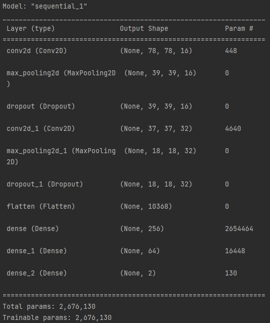
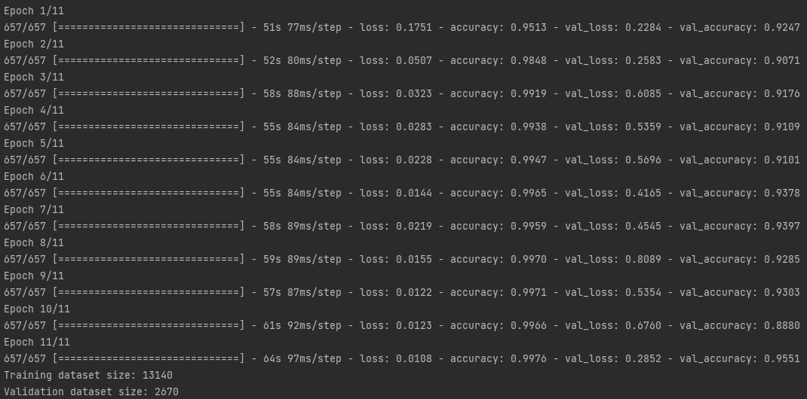

# SUR
VUT-FIT SUR projekt

xgalba03, xpomyk04

## Klasifikátor obličeje
Pro vytvoření modelu klasifikátoru obličeje jsme se rozhodli využít konvoluční neuronovu síť, která má následující strukturu.

1. konvoluční vrstava - 16 filtrů (3x3)
2. max pooling (2x2) a dropout (0.3)
3. konvoluční vrstava - 32 filtrů (3x3)
4. max pooling (2x2) a dropout (0.2)
5. plně propojená vrstva (Relu) - 256 neuronů
5. plně propojená vrstva (Relu) - 64 neuronů
5. plně propojená vrstva (softmax) - 2 neurony

Tento model je implementován a natrénován pomocí rozhraní keras, který pracuje nad frameworkem tensorflow (framework pro práci s n. sítěmi).
Implementace modelu je ve zdrojovém souboru img_class_nn.py

### Předzpracování trénovacích dat
Data která dostupná pro trénování se skládají z:

1. 160 obrázků pro trénování (20 non-target a 140 non-target)
2. 30 obrázků pro validaci (20 non-target a 10 target)

Tyto data jsou postupně načteny pomocí knihovny cv2, převedeny a převedeny do RGB formátu.
Při načítání datasetu je z každého obrázku syntetizováno pomocí transformací několik dalších (knihovna albumentations).
Tímto dojde k rozšíření datasetu. až na 13140 trénovacích dat a 2670 validačních dat.
Obrázky jsou uloženy jako pole (80x80x3) matic s hodnotami normalizovanými do rozsahu (0-1) pro rychlejší zpracování neuronovou sítí.

### Trénování 
Neuronová síť je trénována pomocí batchů o velikosti 20 na 11 epoch.
Dosažené kvality neuronové sítě na validačních datech je možno vidět na následujicím obrázku.

### Klasifikace
Při testování na jednotlivých obrázích jsem zjistil že klasifikátor funguje celkem pěkně, ale někdy se "sekne" a označí jako target osobu non-target data s velkou pravděpodobností (>0.9).
Bohužel se mi toto nepodařilo nijak vyřešit.
Hard decision práh pro klasifikaci jsem experimentélně určil na 0.9 (pro target) tak že > 0.9 -> hard decision = 1

## Klasifikátor reči

Klasifikátor rečových dát vo formáte .wav bol implementovaný pomocou Gaussian Mixture Modelu (GMM) vyuýívajúceho EM algoritmus na jednotlivé ktorý výpočtu

Štruktúra zdrojového kódu:
    -načítanie vstpuných dát na trénovanie a klasifikáciu
    -vytvorenie MFCC koeficientov z dát a ich transponovanie a uloženie do dátovej štruktúry
    -určenie vstupných koeficientov GMM modelu (prebieha náhodne)
    -iterácia EM algoritmu pokiaľ dáta neskonvergujú
    -využitie natrénovaných koeficientov na odhadnutie/určenie klasifikácie testovacích dát
    -uloženie výsledkov do súboru .txt

### Klasifikace
    Pri prehodnotení hodnôt vyplívajúcih z GMM boli hodnoty prevedené do intervalu 0-100. Kvôli veľkému rozsahu pôvodných hodnôt bol testovaním učený prah pozitívnej klasifikácie na hodnotu 0.98. (hard decision)

## Použití
Řešení produkuje celkem 3 result soubory, jeden pouze ze zpracování png, druhý ze zpracování wav a třetí z kombinace zpracování png a wav souboru. 

1. image_CNN.txt - soubor s výsledky ze zpracování png souborů (spuštění skriptu img_class_nn.py). Skript očekává složku s trénovacímí daty ve stejném adresáři. Pro spuštění skriptu je třeba nejprve doinstalovat všechny moduly, které potřebuje pomocí 'pip -install'

2. audio_GMM.txt - súbor s výsledkami hodnotenia audio nahrávok, vytvára sa pomocou spustenia skriptu audio_GMM.py a očakáva zložku testovacích dát s názvom 'eval' v rovnakom adresári ako zdrojový kód. Trénovacie dáta sa nachádzajú v zložke train_data/

3. results.txt - súbor obsahujúci výsledky z kombinovanej klasifikácie - audio + obrázok. Pre vyhodnotenie úspešnej klasifikácie musí násobok pravdepodobností dielčich skriptov dosahovať hodnotu 89% - 0.89

